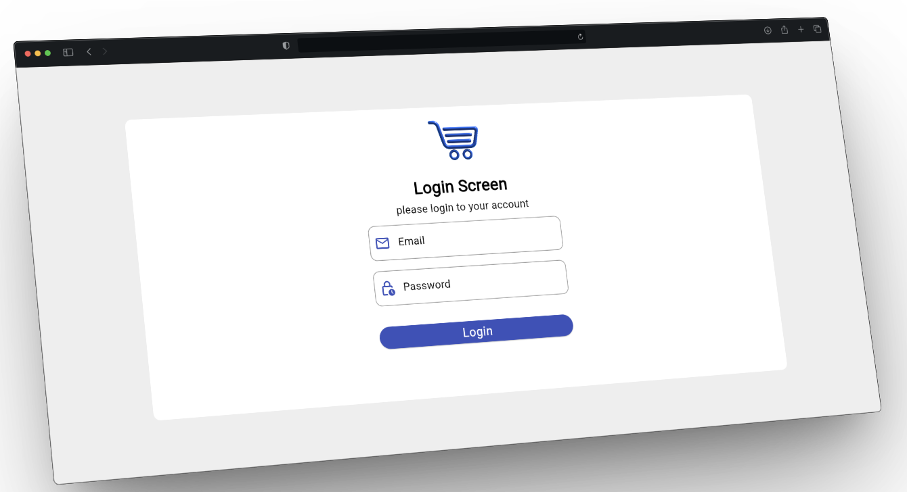
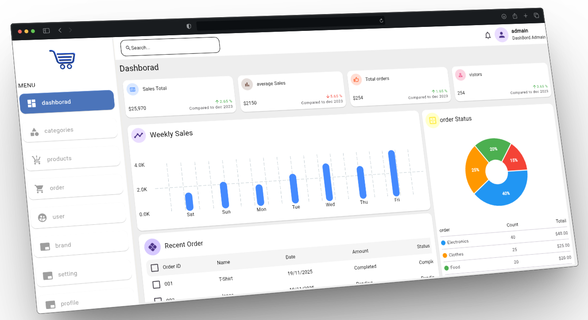
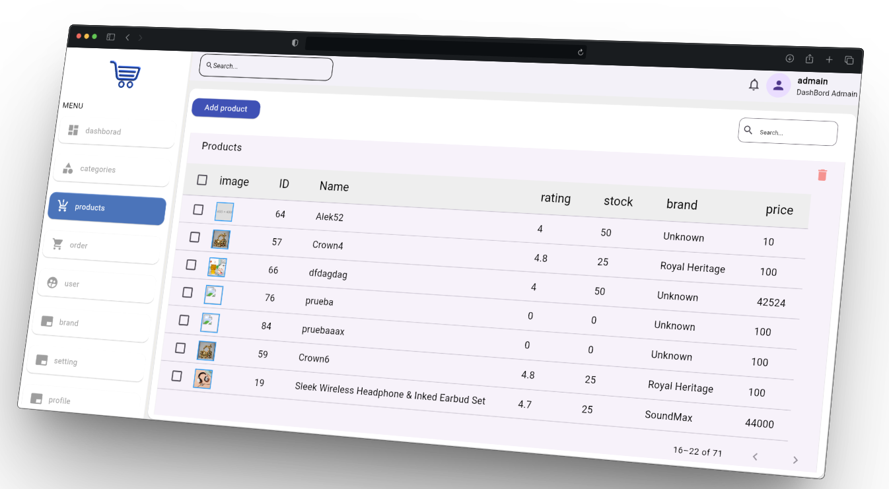

# 🛒 Product Dashboard App

تطبيق **Dashboard احترافي** لإدارة المنتجات، مع عرض الإحصائيات وتتبع البيانات،  
تم بناؤه باستخدام **Flutter + Firebase** مع **MVVM Architecture** و **Cubit State Management** ويدعم **Responsive + Adaptive UI** بالإضافة إلى **Navigator 2.0** و **Deep Linking**.

---

## 📸 Screenshots
 

  

  

  

  

---

## ✨ Features

### 🧩 **إدارة المنتجات**
- إضافة منتج جديد  
- تعديل بيانات المنتج  
- حذف منتج  
- رفع الصور  
- إدارة الفئات (Categories)

### 📊 **إحصائيات (Analytics)**
- عدد المنتجات  
- الطلبات  
- عدد المستخدمين  
- التفاعل اللحظي باستخدام Firebase Stream  

### 🏗 **Architecture**
- MVVM Architecture (Model – View – ViewModel)
- Clean & Scalable structure  
- Separation of concerns

### 🔥 **State Management**
- Cubit (Flutter Bloc)
- Reactive Data Layer

### 🗄️ **Firebase Integration**
- Firebase Authentication  
- Cloud Firestore  
- Firebase Storage  
- Cloud Messaging (Notifications)  
- Realtime Updates  

### 📱 **Responsive + Adaptive**
- تصميم يتكيّف مع:
  - الموبايل  
  - التابلت  
  - الويب  
  - الشاشات الكبيرة (Dashboard)

### 🔗 **Deep Linking**
- دعم الروابط المباشرة  
- فتح صفحات محددة من خارج التطبيق

### 🧭 **Navigation**
- Navigator 2.0 مع Router + Route Information Parser  
- دعم multi-level navigation

---

